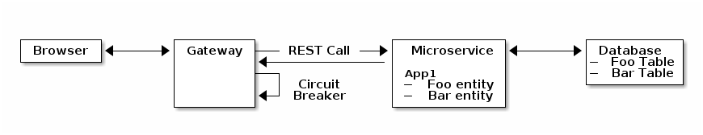
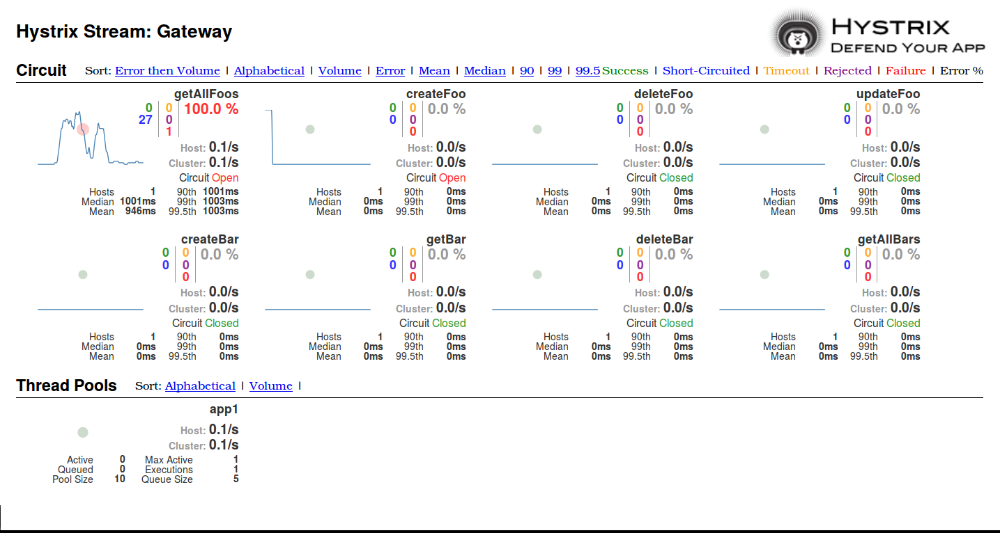

# JHipster Circuit Breaker Demo

Using Spring Cloud, Netflix Feign, Hystrix dashboard...

## Architecture



## Setup

Run the JHipster Registry and Dashboard
	
    docker-compose -f dockerconfig/jhipster-registry.yml up -d
    
    docker-compose -f dockerconfig/jhipster-dashboard.yml up -d

In the gateway and app1 directory, launch apps with:

	mvn

Once everything is correctly started, open the Hystrix dashboard on [http://localhost:8762/](http://localhost:8762/) and point it to the gateway `/hystrix.stream` endpoint to monitor its circuit breakers.

Be careful, using localhost:8080 as an URL here won't work. Because the jhipster-dashboard is run inside a docker container it cannot access localhost. Instead first identify the jhipster-dashboard container ID with `docker ps` then the host IP as seen by docker with `docker inspect containerId |grep \"Gateway`. On my machine the correct URL to input was `172.25.0.1:8080/hystrix.stream`.

## Experiment

Once you have started everything, open the gateway on [http://localhost:8080](http://localhost:8080) and add some sample foos and bars using the Entities tab.

Behind the scenes, the gateway is forwarding requests to the app1 microservice on which a Foo and Bar entities were generated.
This is the classic way of calling a microservice by routing the calls through a Zuul proxy. This way is fine in most cases and will efficiently load balance between service instances if you want to scale them, however it doesn't handle failure of a microservice.

To try out a fallback open Swagger UI: [http://localhost:8080/#/docs](http://localhost:8080/#/docs) and do some calls on the "default" API (this corresponds to the Gateway's API).
There you can use try out endpoints under Foo Ressource and Bar ressource. Those can be used to do CRUD operations on the microservice's Foo and Bar entities. However if the service is unavailable or respond with an error it will trigger the fallback.

You can try to kill the app1 service and see the circuit opening in the dashboard after a number of failed request. In the meantime, you should not have received any errors in your browser as the current fallback send a 200 OK in all cases.



# How it works

To allow execution of a fallback using the circuit breaker pattern, a REST client for the app1 microservice must be written on the gateway. This is very easily done using the Feign library and its integration in Spring Cloud. This is written as an interface like this:

```
@FeignClient(name = "app1", fallback = App1FooClientFallback.class)
public interface App1FooClient {

    @RequestMapping(value = "/api/foos",
        method = RequestMethod.POST,
        produces = MediaType.APPLICATION_JSON_VALUE,
        consumes = MediaType.APPLICATION_JSON_VALUE)
    ResponseEntity<FooDTO> createFoo(FooDTO foo);

    @RequestMapping(value = "/api/foos/{id}",
        method = RequestMethod.GET,
        produces = MediaType.APPLICATION_JSON_VALUE)
    ResponseEntity<FooDTO> getFoo(@PathVariable("id") Long id);
}
```

And the associated fallback class where you can define fallback behaviour:
```
@Component
public class App1FooClientFallback implements App1FooClient {

    private final Logger log = LoggerFactory.getLogger(App1FooClientFallback.class);

    @Override
    public ResponseEntity<FooDTO> createFoo(FooDTO foo) {
        log.warn("Triggered fallback for createFoo : {}", foo);
        return null;
    }

    @Override
    public ResponseEntity<FooDTO> getFoo(@PathVariable("id") Long id) {
        log.warn("Triggered fallback for getFoo, id: {}", id);
        return null;
    }
}
```
You can then simply use this interface in one of your REST Controller.


